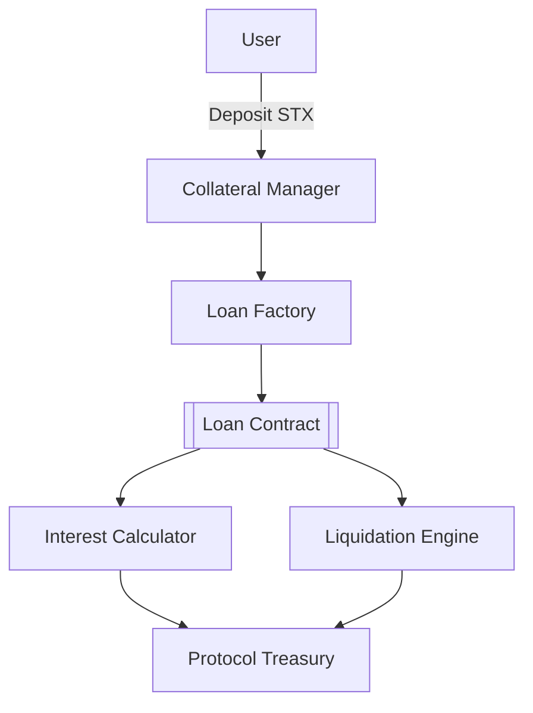

# Bitcoin Lend - Decentralized Lending Protocol for Stacks Blockchain

A decentralized lending protocol leveraging Bitcoin's security through the Stacks blockchain. Enables STX-collateralized loans with automated risk management and yield generation features.

## Key Features ✨

- **Bitcoin-Compatible** - Built on Stacks L2 with Bitcoin finality
- **Dynamic Interest Rates** - Per-block compounding interest calculation
- **Risk-Managed Collateral**  
  - 150% minimum collateral ratio
  - 130% liquidation threshold
- **Protocol Economics**
  - 1% protocol fee on interest
  - 5% liquidation bonus (split between liquidators and protocol)
- **Emergency Circuit Breaker** - Admin-controlled pause functionality

## System Architecture 🏛️

### Core Components

1. **Collateral Management**
   - STX token deposits/withdrawals
   - Real-time collateral ratio monitoring
   - Cross-contract asset valuation

2. **Loan Engine**
   - Loan lifecycle management
   - Interest accrual (5% APY base rate)
   - Health factor calculations

3. **Liquidation Module**
   - Under-collateralization detection
   - Dutch auction-style incentives
   - Protocol fee distribution

4. **Risk Framework**
   - Global pause functionality
   - Parameter configurability
   - Block-height based accounting

### Technical Implementation



## Key Specifications 🔧

| Parameter | Value | Description |
|-----------|-------|-------------|
| `COLLATERAL-RATIO` | 150% | Minimum collateralization ratio |
| `LIQUIDATION-THRESHOLD` | 130% | Auto-liquidation threshold |
| `INTEREST-RATE-YEARLY` | 5.0% | Base annual interest rate |
| `PROTOCOL-FEE-PERCENT` | 1.0% | Fee on interest payments |
| `BLOCKS-PER-YEAR` | 52,560 | 10-minute block assumption |

## Security Model 🔒

### Safeguards
- **Collateral Verification**
  ```clarity
  (asserts! (>= collateral-value minimum-collateral-required)
  ```
- **Re-entrancy Protection** - Strict state management
- **Precision Handling** - 6-decimal fixed-point arithmetic
- **Role-Based Access**
  ```clarity
  (define-constant CONTRACT-OWNER tx-sender)
  (asserts! (is-eq tx-sender CONTRACT-OWNER))
  ```

### Audit Considerations
- Formal verification for critical math operations
- Time-dependent logic using block heights
- STX transfer atomicity checks

## Usage Guide 🚀

### 1. Deposit Collateral
```bash
clarinet contract call bitcoin-lend deposit --amount 5000000 --sender wallet_1
```

### 2. Open Loan Position
```bash
clarinet contract call bitcoin-lend borrow \
  --collateral-amount 3000000 \
  --loan-amount 2000000 \
  --sender wallet_1
```

### 3. Monitor Loan Health
```clarity
(contract-call? 'bitcoin-lend get-loan-health loan-id)
```

### 4. Repay Loan
```bash
clarinet contract call bitcoin-lend repay-loan \
  --loan-id 42 \
  --repay-amount 2100000 \
  --sender wallet_1
```

### 5. Liquidate Position
```bash
clarinet contract call bitcoin-lend liquidate \
  --loan-id 42 \
  --amount 2500000 \
  --sender liquidator_wallet
```

## Contribution Guidelines 👥

1. Fork repository
2. Install Clarinet SDK
3. Submit PR with detailed documentation
